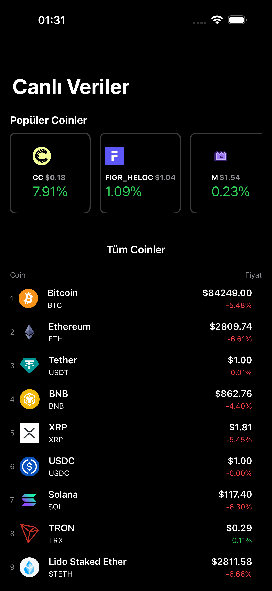
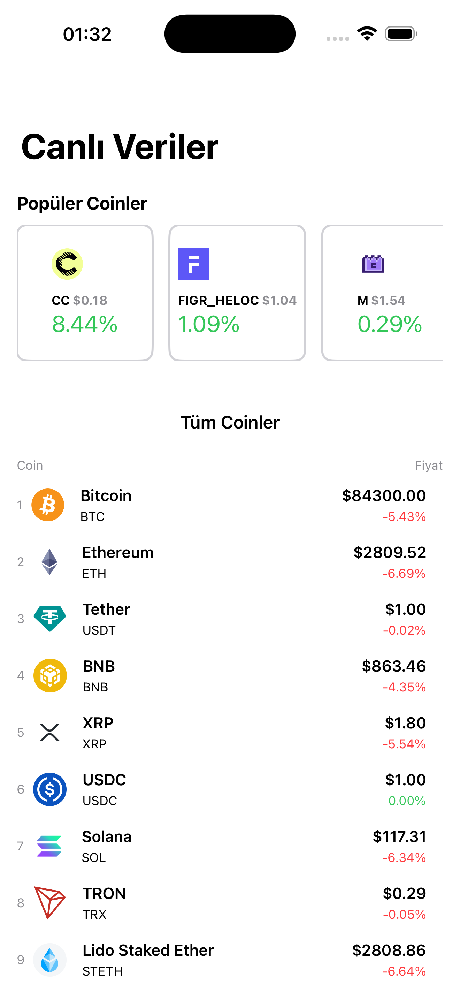

# Trades - Canlı Kripto Para Takip Uygulaması 🚀

Trades, **SwiftUI** ve **MVVM** mimarisi kullanılarak geliştirilmiş, kripto para piyasalarını anlık olarak takip etmenizi sağlayan modern bir iOS uygulamasıdır. [CoinGecko API](https://www.coingecko.com/en/api) üzerinden alınan verilerle en popüler 100 coin'in verilerini anlık olarak listeler ve en çok hareket edenleri (Top Movers) filtreler.

## 📱 Uygulama Görünümleri

| Koyu Tema | Açık Tema |
| :---: | :---: |
|  |  |

## ✨ Özellikler

- **Canlı Veri Takibi:** CoinGecko API entegrasyonu ile gerçek zamanlı fiyat, piyasa değeri ve değişim oranları.
- **Top Movers:** Son 24 saat içinde en yüksek fiyat artışı yaşayan coinlerin otomatik filtrelenmesi.
- **Modern UI:** SwiftUI ile geliştirilmiş, kullanıcı dostu ve akıcı arayüz.
- **Tema Desteği:** Hem Koyu (Dark) hem de Açık (Light) mod ile tam uyum.
- **Performans:** URLSession ve asenkron veri işleme ile takılmayan, akıcı liste deneyimi.

## 🛠️ Kullanılan Teknolojiler ve Teknik Detaylar

- **SwiftUI:** Modern ve deklaratif UI tasarımı için.
- **MVVM Mimarisi:** Kodun okunabilirliği ve sürdürülebilirliği için Model-View-ViewModel yapısı.
- **CoinGecko API:** Kripto para verilerini çekmek için kullanılan güvenilir servis.
- **Codable & JSON Parsing:** API'den gelen karmaşık verilerin `quicktype.io` yardımıyla oluşturulan modellerle (Coin Model) Swift nesnelerine dönüştürülmesi.
- **Multithreading:** Veri çekme işlemlerinin arka planda yapılıp, UI güncellemelerinin `DispatchQueue.main.async` ile ana thread'e aktarılması.

## 📂 Proje Yapısı

```text
Trades/
├── App/                # Uygulama giriş noktası (TradesApp)
├── Core/               # Ana özellikler
│   ├── Home/
│   │   ├── ViewModels/ # HomeViewModel (Mantıksal işlemler)
│   │   └── Views/      # HomeView, AlCoinsView, TopMoversView
├── Models/             # Veri modelleri (Coin, Roi, Sparkline)
├── Extension/          # Swift/SwiftUI genişletmeleri
└── Assets.xcassets/    # Renk setleri ve uygulama içi görseller
